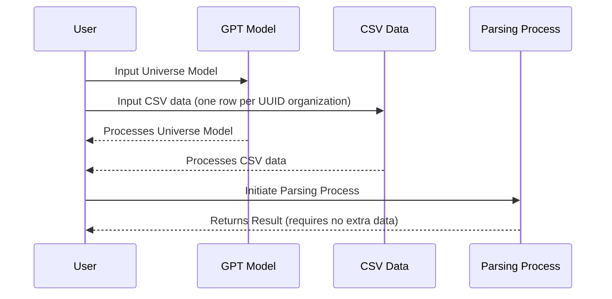

# TypeChat with TypeScript Types and Crunchbase Query

TypeChat is a powerful tool that allows you to generate JSON using TypeScript types. This can be particularly useful when you want to limit the types of data that can be inputted into your program.

## How it Works

1. **User Inputs**: The user inputs the Universe Model into the GPT Model and CSV data (one row per UUID organization) from a Crunchbase query into the CSV Data.
2. **Processing**: Both the GPT Model and CSV Data process their respective inputs and return the results to the User.
3. **Parsing Process Initiation**: The user initiates the Parsing Process with these results.
4. **Final Result**: The Parsing Process returns the final result to the User, requiring no extra data.

This diagram shows the flow of data and processes in the system. It starts with the user inputting data into the GPT Model and CSV Data. These components then process the data and return the results to the user. The user then initiates the Parsing Process with these results, which finally returns the final result back to the user.

## See also older scripts in git history

Older xstate machine and scripts are in git history.