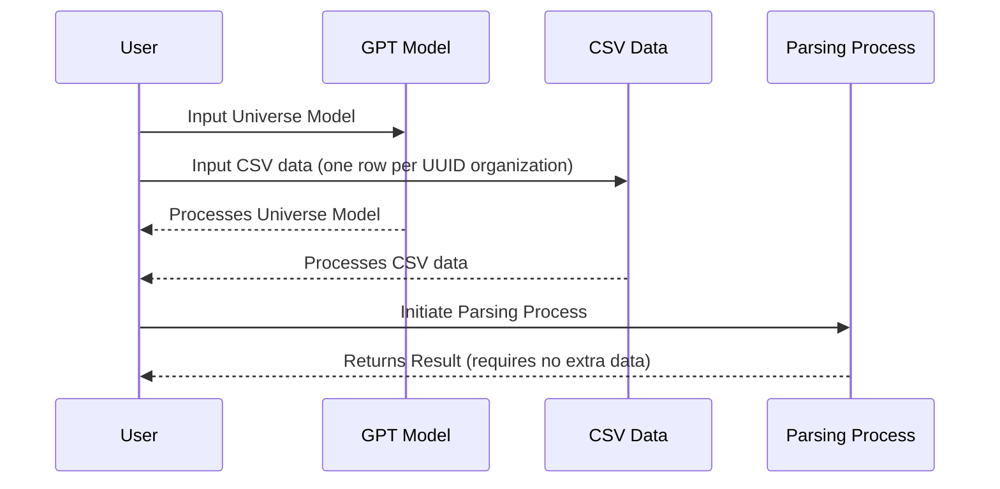

# TypeChat with TypeScript Types and Crunchbase Query

TypeChat is a powerful tool that allows you to generate JSON using TypeScript types. This can be particularly useful when you want to limit the types of data that can be inputted into your program.

## How it Works

1. **User Inputs**: The user inputs the Universe Model into the GPT Model and CSV data (one row per UUID organization) from a Crunchbase query into the CSV Data.
2. **Processing**: Both the GPT Model and CSV Data process their respective inputs and return the results to the User.
3. **Parsing Process Initiation**: The user initiates the Parsing Process with these results.
4. **Final Result**: The Parsing Process returns the final result to the User, requiring no extra data.

This diagram shows the flow of data and processes in the system. It starts with the user inputting data into the GPT Model and CSV Data. These components then process the data and return the results to the user. The user then initiates the Parsing Process with these results, which finally returns the final result back to the user.



## API

const axios = require('axios');

// Base URL for Crunchbase 4.0 API
const baseUrl = "https://api.crunchbase.com/api/v4/entities";

// Your API key
const apiKey = "{your_api_key}";

// Headers for the request
const headers = {
    "Content-Type": "application/json",
    "Authorization": `Bearer ${apiKey}`,
};

// Function to get entity data
async function getEntityData(entityType, entityId) {
    const url = `${baseUrl}/${entityType}/${entityId}`;
    const response = await axios.get(url, { headers });
    return response.data;
}

// Function to get card data
async function getCardData(entityType, entityId, cardId) {
    const url = `${baseUrl}/${entityType}/${entityId}/cards/${cardId}`;
    const response = await axios.get(url, { headers });
    return response.data;
}

// Example usage:
getEntityData("organizations", "{organization_id}")
    .then(organizationData => {
        // Now you can access the fields in the returned data
        const companyName = organizationData["data"]["properties"]["name"];
        const crunchbaseRank = organizationData["data"]["properties"]["rank"];
        console.log(`Company Name: ${companyName}, Rank: ${crunchbaseRank}`);
    });

getCardData("organizations", "{organization_id}", "{card_id}")
    .then(cardData => {
        // Process card data
    });

# Minerva: Your Intelligent Investment Guide

Minerva is an innovative system designed to facilitate investment decisions. It aligns with report interest lines by utilizing specific document types submitted by the user.

By leveraging a comprehensive knowledge base and real-time data analysis, Minerva provides insightful advice to assist investors in their decision-making process. You can submit reports about an organization and Minerva will meticulously analyze them for Organization intent.

Feel free to submit your documents for review. Minerva is capable of processing various document types, however, unrecognized ones may not be processed. Only the top three will be picked.

---

## Disclaimer

> **Important:** Please be aware that this is a research preview and the system is currently under development. Therefore, users are strongly advised not to solely depend on the information provided.

## Document

```
As generative AI continues to sweep an increasingly digital, hyperconnected world, NVIDIA founder and CEO Jensen Huang made a thunderous return to SIGGRAPH, the world’s premier computer graphics conference.

“The generative AI era is upon us, the iPhone moment if you will,” Huang told an audience of thousands Tuesday during an in-person special address in Los Angeles.

News highlights include the next-generation GH200 Grace Hopper Superchip platform, NVIDIA AI Workbench — a new unified toolkit that introduces simplified model tuning and deployment on NVIDIA AI platforms — and a major upgrade to NVIDIA Omniverse with generative AI and OpenUSD.

The announcements are about bringing all of the past decade’s innovations — AI, virtual worlds, acceleration, simulation, collaboration and more — together.

“Graphics and artificial intelligence are inseparable, graphics needs AI, and AI needs graphics,” Huang said, explaining that AI will learn skills in virtual worlds, and that AI will help create virtual worlds.
```

## Intent detection

Examples

## Prompt

Complete the report. Do not repeat the raw data.

## See also older scripts in git history

Older xstate machine and scripts are in git history.