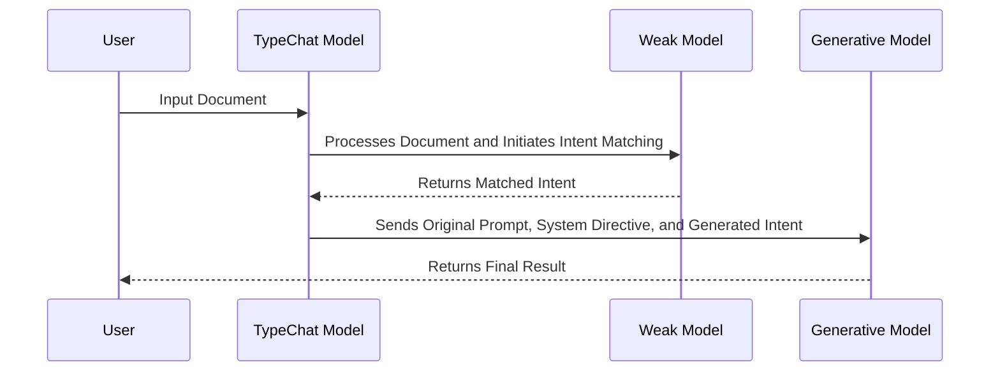

# README

## Overview

This document provides a detailed explanation of the system workflow. The process involves three main steps:

1. **User Inputs**: The user inputs the document into the TypeChat Model.
2. **Weak Intent Matching**: The TypeChat Model processes the input and initiates the Intent Matching Process with a weak model, returning a matched intent.
3. **Strong Generative Model Processing**: The original prompt, system directive, and generated intent are then processed by a strong generative model.
4. **Final Result**: The User receives the final result.

## Detailed Workflow

The following sequence diagram illustrates the flow of data and processes in the system:

In this workflow:

- The process begins with the user inputting data into the TypeChat Model.
- The TypeChat Model then processes the data and initiates the Intent Matching Process with a weak model, returning a matched intent.
- The original prompt, system directive, and generated intent are then processed by a strong generative model.
- Finally, the user receives the final result.

## Metaphorical Explanation: The Car Analogy

To better understand this system, let's use the metaphor of a car.

1. **User Inputs**: This is like the fuel for the car. It's the entire document or work that you provide to power the system. Without it, the system won't be able to function.

2. **Weak Intent Matching**: Think of this as the car's alternator. It's not the main source of power, but it plays a crucial role in starting the engine and keeping the battery charged. In our system, the weak model quickly identifies the general intent of the user's input, setting things in motion.

3. **Strong Generative Model Processing**: This is the car's engine. It's where the real power comes from. Just like how an engine uses fuel to generate power and drive the car, the strong generative model takes the initial intent identified by the weak model and refines it using complex algorithms and computational power.

4. **Final Result**: This is your destination. After the engine has done its work, you arrive at your desired location. Similarly, the output from the strong generative model is delivered to the user as the final result.

Just like a car needs both fuel and an engine to function effectively, our system combines the comprehensive data from the user (fuel) with the speed and efficiency of the weak model (alternator) and the accuracy and detail of the strong model (engine). The alternator (weak model) gets things going quickly, and then the engine (strong model) takes over to provide the power needed for the journey (final result).