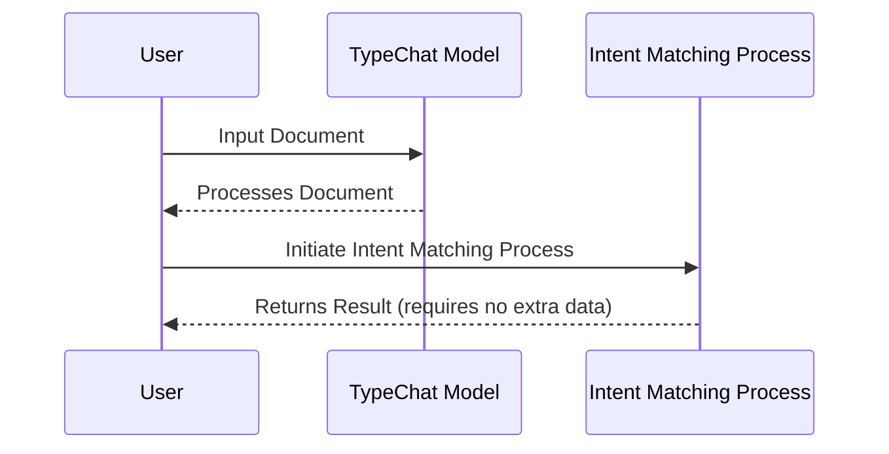

# README

## How it Works

1. **User Inputs**: The user inputs the document into the TypeChat Model.
2. **Processing**: The TypeChat Model processes the input and returns the results to the User.
3. **Intent Matching**: The user initiates the Intent Matching Process with these results.
4. **Final Result**: The Intent Matching Process returns the final result to the User, requiring no extra data.

This diagram shows the flow of data and processes in the system. It starts with the user inputting data into the TypeChat Model. This component then processes the data and return the results to the user. The user then initiates the Intent Matching Process with these results, which finally returns the final result back to the user.

