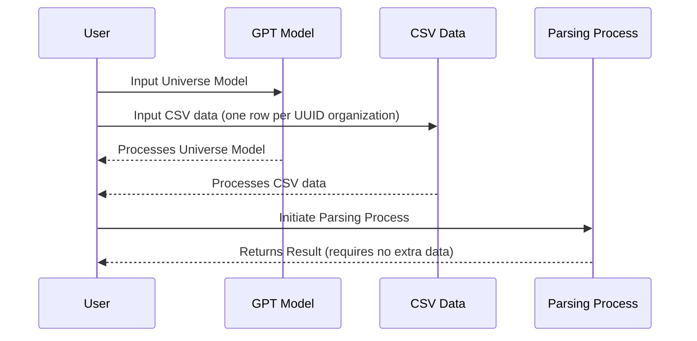

# TypeChat with TypeScript Types and Crunchbase Query

TypeChat is a powerful tool that allows you to generate JSON using TypeScript types. This can be particularly useful when you want to limit the types of data that can be inputted into your program.

## How it Works

1. **User Inputs**: The user inputs the Universe Model into the GPT Model and CSV data (one row per UUID organization) from a Crunchbase query into the CSV Data.
2. **Processing**: Both the GPT Model and CSV Data process their respective inputs and return the results to the User.
3. **Parsing Process Initiation**: The user initiates the Parsing Process with these results.
4. **Final Result**: The Parsing Process returns the final result to the User, requiring no extra data.

This diagram shows the flow of data and processes in the system. It starts with the user inputting data into the GPT Model and CSV Data. These components then process the data and return the results to the user. The user then initiates the Parsing Process with these results, which finally returns the final result back to the user.

## Find uuid

ORGANIZATION_QUERY = "Google"
API_KEY = "1234567890ABCDEF"

curl -X 'GET' \
  'https://api.crunchbase.com/api/v4/autocompletes?query=${ORGANIZATION_QUERY}' \
  -H 'accept: application/json' \
  -H 'X-cb-user-key: API_KEY'

## Crunchbase fields

"Crunchbase Fields","Field Type","Required"
"Acquired By","string",""
"Acquired Date","date",""
"Acquired Price","currency (USD)",""
"All Investors","long text area (value separated by ;)",""
"City","string",""
"Closed Date","date",""
"Company Name","string",""
"Country","string",""
"Crunchbase Categories","multi-select picklists","YES"
"Crunchbase Rank","integer","YES"
"Crunchbase Rank Movement (last 7 days)","numeric",""
"Crunchbase Rank Movement (last 30 days)","numeric","YES"
"Crunchbase Rank Movement (last 90 days)","numeric",""
"Crunchbase URL","url","YES"
"Diversity Spotlight","long text area (value separated by ;)",""
"Founded Date","date",""
"Full Description","text area",""
"IPO Date","date",""
"Latest Acquired Company","string",""
"Latest Acquisition Date","date",""
"Latest Acquisition Price","currency (USD)",""
"Latest Investment - Amount Invested (USD)","currency (USD)",""
"Latest Investment - Company","string",""
"Latest Investment - Date","date",""
"Latest Round - Date","date","YES"
"Latest Round - Funding Type / Series","picklist","YES"
"Latest Round - Money Raised (USD)","currency (USD)","YES"
"Legal Name","string",""
"Number of Acquisitions (#)","integer",""
"Number of Employees","picklist","YES"
"Number of Founders","integer",""
"Number of Funding Rounds (#)","integer",""
"Number of Investments (#)","integer",""
"Number of Investors (#)","integer",""
"Organization Status","string",""
"Postal Code","string",""
"Profile Image URL","url",""
"Region","string",""
"Revenue Range (USD)","picklist","YES"
"Short Description","string",""
"Stock Exchange","string",""
"Stock Symbol","string",""
"Street","string",""
"Total Funding (USD)","currency (USD)","YES"
"Total Money Invested (USD)","currency (USD)",""
"Website","url",""

## Fetch api

https://api.crunchbase.com/api/v4/entities/organizations/google?card_ids=%5B%22acquiree_acquisitions%22%2C%22acquirer_acquisitions%22%2C%22child_organizations%22%2C%22child_ownerships%22%2C%22event_appearances%22%2C%22fields%22%2C%22founders%22%2C%22headquarters_address%22%2C%22investors%22%2C%22ipos%22%2C%22jobs%22%2C%22key_employee_changes%22%2C%22layoffs%22%2C%22parent_organization%22%2C%22parent_ownership%22%2C%22participated_funding_rounds%22%2C%22participated_funds%22%2C%22participated_investments%22%2C%22press_references%22%2C%22raised_funding_rounds%22%2C%22raised_funds%22%2C%22raised_investments%22%5D

## API

const axios = require('axios');

// Base URL for Crunchbase 4.0 API
const baseUrl = "https://api.crunchbase.com/api/v4/entities";

// Your API key
const apiKey = "{your_api_key}";

// Headers for the request
const headers = {
    "Content-Type": "application/json",
    "Authorization": `Bearer ${apiKey}`,
};

// Function to get entity data
async function getEntityData(entityType, entityId) {
    const url = `${baseUrl}/${entityType}/${entityId}`;
    const response = await axios.get(url, { headers });
    return response.data;
}

// Function to get card data
async function getCardData(entityType, entityId, cardId) {
    const url = `${baseUrl}/${entityType}/${entityId}/cards/${cardId}`;
    const response = await axios.get(url, { headers });
    return response.data;
}

// Example usage:
getEntityData("organizations", "{organization_id}")
    .then(organizationData => {
        // Now you can access the fields in the returned data
        const companyName = organizationData["data"]["properties"]["name"];
        const crunchbaseRank = organizationData["data"]["properties"]["rank"];
        console.log(`Company Name: ${companyName}, Rank: ${crunchbaseRank}`);
    });

getCardData("organizations", "{organization_id}", "{card_id}")
    .then(cardData => {
        // Process card data
    });

# Minerva: Your Intelligent Investment Guide

Minerva is an innovative system designed to facilitate investment decisions. It aligns with report interest lines by utilizing specific document types submitted by the user.

By leveraging a comprehensive knowledge base and real-time data analysis, Minerva provides insightful advice to assist investors in their decision-making process. You can submit reports about an organization and Minerva will meticulously analyze them for Organization intent.

Feel free to submit your documents for review. Minerva is capable of processing various document types, however, unrecognized ones may not be processed. Only the top three will be picked.

---

## Disclaimer

> **Important:** Please be aware that this is a research preview and the system is currently under development. Therefore, users are strongly advised not to solely depend on the information provided.

## Document

You: Top lawyer at Fox Corp. to step down after overseeing $787M settlement in Dominion defamation case The chief legal officer at Fox Corp. who oversaw a $787 million settlement with Dominion Voting Systems over defamation allegations against Fox News is leaving the company ByThe Associated Press August 11, 2023, 3:27 PM Fox Lawyer Stepping Down In this image provided by Fox Corp., Viet Dinh, the chief legal officer at the company, poses for a photo. On Friday, Aug. 11, 2023, Fox Corp. said that Dinh, who oversaw a $787 million settlement with Dominion Voting Systems over defamation allegations... The Associated Press NEW YORK -- Fox Corp. said Friday that its chief legal officer who oversaw a $787 million settlement with Dominion Voting Systems over defamation allegations is leaving the company. Viet Dinh, Fox's chief legal and policy officer, will step down effective Dec. 31, the New York-based company said in a statement. He will remain a “special advisor” to Fox Corp., it added. Fox News, a unit of Fox Corp., agreed to settle the case brought by the voting machine producer in mid-April following weeks of pretrial disclosures that revealed the network had aired false claims about the 2020 U.S. presidential election, even though many within the company knew they were not true. The company did not say why Dinh was leaving Fox Corp. Brian Nick, a spokesman for Fox, said the company had no comment beyond the statement.
Agent: {"items":[{"intent":"Legal and Regulatory Compliance","identificationMethod":"Company Announcements and Press Releases"},{"intent":"Legal and Regulatory Compliance","identificationMethod":"Company Announcements and Press Releases"},{"intent":"Legal and Regulatory Compliance","identificationMethod":"Company Announcements and Press Releases"}]}

## Prompt

Complete the report. Do not repeat the raw data.

## See also older scripts in git history

Older xstate machine and scripts are in git history.