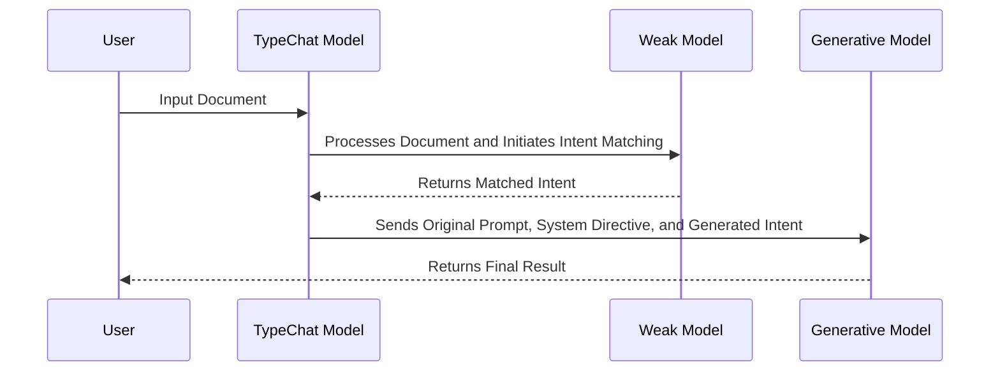

# README

## Overview

This document provides a detailed explanation of the system workflow. The process involves three main steps:

1. **User Inputs**: The user inputs the document into the TypeChat Model.
2. **Weak Intent Matching**: The TypeChat Model processes the input and initiates the Intent Matching Process with a weak model, returning a matched intent.
3. **Strong Generative Model Processing**: The original prompt, system directive, and generated intent are then processed by a strong generative model.
4. **Final Result**: The User receives the final result.

## Detailed Workflow

The following sequence diagram illustrates the flow of data and processes in the system:

In this workflow:

- The process begins with the user inputting data into the TypeChat Model.
- The TypeChat Model then processes the data and initiates the Intent Matching Process with a weak model, returning a matched intent.
- The original prompt, system directive, and generated intent are then processed by a strong generative model.
- Finally, the user receives the final result.