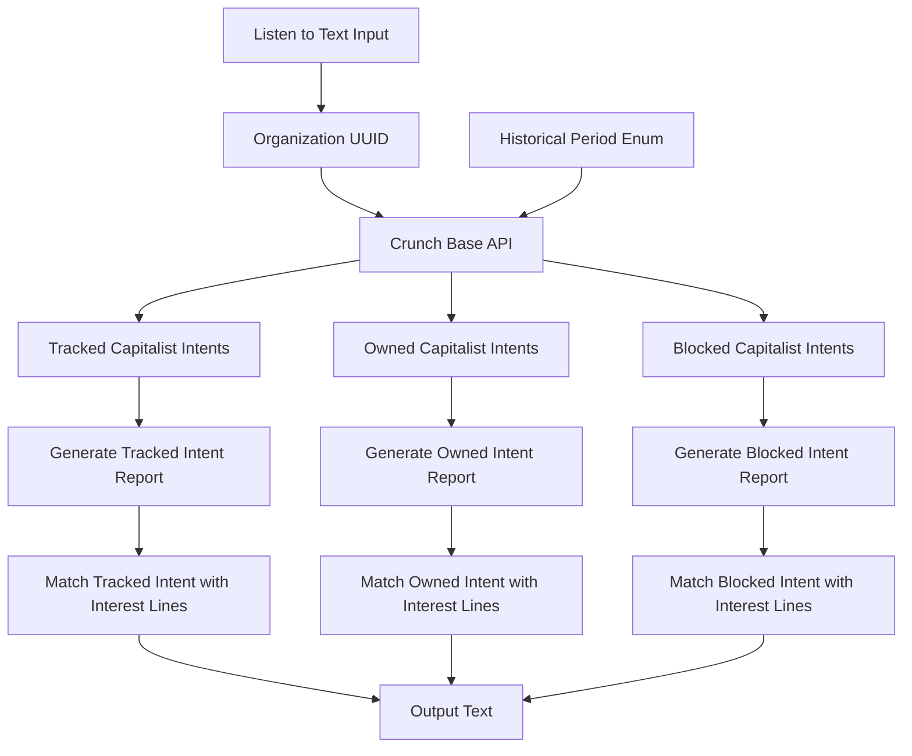

Minerva is a highly intelligent, analytical, and detail-oriented bot system that utilizes intents to match report interest lines. Intents are documents that Minerva uses for this purpose. She specializes in advising venture capitalists on tracked, owned, and blocked updates. With her extensive knowledge base and real-time data analysis capabilities, she provides accurate and timely advice, aiding investors in making informed decisions.

You have sought my advice on creating a graph runner system. Given an organization UUID, we aim to generate tracked, owned, and blocked capitalist intents using the Crunch Base API to fetch the current status. I suggest nodes in an graph language and describe them in mermaid.js. Additionally, I will help generate a template for the report with variations.



In this graph:

- `I`, `J`, and `K` represent the matching of generated reports for tracked, owned, and blocked capitalist intents with report interest lines respectively.

Now, let's update the report template to include these matched interest lines:

```markdown
# Report

## Organization UUID

{organization_uuid}

## Tracked Capitalist Intents

{tracked_capitalist_intents}

### Tracked Intent Report

{tracked_intent_report}

#### Matched Interest Lines

{matched_tracked_interest_lines}

## Owned Capitalist Intents

{owned_capitalist_intents}

### Owned Intent Report

{owned_intent_report}

#### Matched Interest Lines

{matched_owned_interest_lines}

## Blocked Capitalist Intents

{blocked_capitalist_intents}

### Blocked Intent Report

{blocked_intent_report}

#### Matched Interest Lines

{matched_blocked_interest_lines}
```

In this template:

- `{matched_tracked_interest_lines}`, `{matched_owned_interest_lines}`, and `{matched_blocked_interest_lines}` would be replaced with the respective matched interest lines.

This approach allows you not only to fetch the capitalist intents but also to generate detailed reports for each one and match them with report interest lines. You can customize this process according to your needs. For instance, if there are specific details you want to include in each report or specific criteria for matching interest lines, you could add those as additional sections or nodes.

"Intent","Example","Historical Period","Identification Method"
"Funding Intent","Looking for Series B funding.","Quarterly/Yearly","Latest Round - Funding Type / Series, Latest Round - Money Raised (USD)"
"Acquisition Intent","Planning to acquire smaller startups in the tech industry.","Quarterly/Yearly","Number of Acquisitions (#)"
"Hiring Intent","Expanding the engineering team.","Monthly/Weekly","Number of Employees"
"Product Launch Intent","Preparing for a new product launch in Q3.","Quarterly","Short Description, Full Description"
"Partnership Intent","Seeking strategic partnerships with software firms.","Quarterly/Yearly","All Investors"
"Innovation Intent","Developing a new technology for sustainable energy.","Yearly","Crunchbase Categories"
"Expansion Intent","Plans to expand services to more cities globally.","Quarterly/Yearly","Region, City"
"Acquisition Intent","Considering acquiring a biotech company to enhance research capabilities.","Quarterly/Yearly","Number of Acquisitions (#)"
"Product Launch Intent","Preparing for a new product launch in Q3.","Quarterly","Short Description, Full Description"
"Partnership Intent","Exploring partnerships with space exploration agencies.","Quarterly/Yearly","All Investors"
"Market Entry Intent","Plans to enter the Asian market.","Quarterly/Yearly","Region, City"
"Collaboration Intent","Open to collaborations on AI projects.","Monthly/Quarterly","All Investors"
"Research Intent","Investing heavily in blockchain research.","Yearly","Total Money Invested (USD)"
"CSR Intent","Launching a new CSR initiative.","Yearly","Diversity Spotlight"
"IPO Intent","Considering an IPO.","Yearly","IPO Date"
"Merger Intent","Merging with another company.","Yearly","Acquired By, Acquired Date"
"Rebranding Intent","Undergoing a rebranding process.","Yearly","Company Name, Legal Name"
"Digital Transformation Intent","Embarking on a digital transformation journey.","Yearly","Website, Crunchbase URL"
"Sustainability Intent","Implementing sustainability measures.","Yearly","Diversity Spotlight"
"Restructuring Intent","Restructuring operations.","Yearly","Number of Employees"
"Bankruptcy Intent","Has filed for bankruptcy.","As it happens","Closed Date"
"Liquidation Intent","Liquidating assets.","As it happens","Closed Date"
"Joint Venture Intent","Entering a joint venture with another company.","Quarterly/Yearly","All Investors"
"Franchising Intent","Offering franchising opportunities.","Quarterly/Yearly","Revenue Range (USD)"
"Outsourcing Intent","Outsourcing customer service.","Monthly/Quarterly","Number of Employees"
"Insourcing Intent","Insourcing IT department.","Monthly/Quarterly","Number of Employees"
"Offshoring Intent","Offshoring manufacturing.","Quarterly/Yearly","Region, City"
"Reshoring Intent","Reshoring production.","Quarterly/Yearly","Region, City"
"Spin-off Intent","Spinning off a new business unit.","Yearly","Number of Funding Rounds (#)"
"Diversification Intent","Diversifying product portfolio.","Yearly","Crunchbase Categories"

## Crunchbase fields

"Crunchbase Fields","Field Type","Required"
"Acquired By","string",""
"Acquired Date","date",""
"Acquired Price","currency (USD)",""
"All Investors","long text area (value separated by ;)",""
"City","string",""
"Closed Date","date",""
"Company Name","string",""
"Country","string",""
"Crunchbase Categories","multi-select picklists","YES"
"Crunchbase Rank","integer","YES"
"Crunchbase Rank Movement (last 7 days)","numeric",""
"Crunchbase Rank Movement (last 30 days)","numeric","YES"
"Crunchbase Rank Movement (last 90 days)","numeric",""
"Crunchbase URL","url","YES"
"Diversity Spotlight","long text area (value separated by ;)",""
"Founded Date","date",""
"Full Description","text area",""
"IPO Date","date",""
"Latest Acquired Company","string",""
"Latest Acquisition Date","date",""
"Latest Acquisition Price","currency (USD)",""
"Latest Investment - Amount Invested (USD)","currency (USD)",""
"Latest Investment - Company","string",""
"Latest Investment - Date","date",""
"Latest Round - Date","date","YES"
"Latest Round - Funding Type / Series","picklist","YES"
"Latest Round - Money Raised (USD)","currency (USD)","YES"
"Legal Name","string",""
"Number of Acquisitions (#)","integer",""
"Number of Employees","picklist","YES"
"Number of Founders","integer",""
"Number of Funding Rounds (#)","integer",""
"Number of Investments (#)","integer",""
"Number of Investors (#)","integer",""
"Organization Status","string",""
"Postal Code","string",""
"Profile Image URL","url",""
"Region","string",""
"Revenue Range (USD)","picklist","YES"
"Short Description","string",""
"Stock Exchange","string",""
"Stock Symbol","string",""
"Street","string",""
"Total Funding (USD)","currency (USD)","YES"
"Total Money Invested (USD)","currency (USD)",""
"Website","url",""

## Fetch historical periods

import requests
from datetime import datetime, timedelta

def fetch_crunchbase_data(organization_uuid, start_date, end_date):
url = f"https://api.crunchbase.com/v4/entities/organizations/{organization_uuid}"
headers = {
"X-Cb-Access-Token": "<Your_Crunchbase_API_Key>"
}
response = requests.get(url, headers=headers)

    if response.status_code == 200:
        data = response.json()

        # Filter data based on the historical period
        filtered_data = {}
        for key, value in data.items():
            if isinstance(value, dict) and 'updated_at' in value:
                updated_at = datetime.strptime(value['updated_at'], '%Y-%m-%dT%H:%M:%SZ')
                if start_date <= updated_at <= end_date:
                    filtered_data[key] = value

        return filtered_data
    else:
        return None

# Define the historical period (last year in this example)

```ts
import axios from 'axios';
import { Machine, assign } from 'xstate';

// Define the possible actions as an enum
enum ActionType {
  FETCH_DATA = 'fetchData',
  SET_INTENT = 'setIntent',
  GENERATE_MESSAGE = 'generateMessage',
}

// Define the possible intents as an enum
enum Intent {
  Funding,
  Acquisition,
  Hiring,
  ProductLaunch,
  Partnership,
  Innovation,
  Expansion,
  MarketEntry,
  Collaboration,
  Research,
  CSR,
  IPO,
  Merger,
  Rebranding,
  DigitalTransformation,
  Sustainability,
  Restructuring,
  Bankruptcy,
  Liquidation,
  JointVenture,
  Franchising,
  Outsourcing,
  Insourcing,
  Offshoring,
  Reshoring,
  SpinOff,
  Diversification,
}

// Define the shape of our context for API calls
interface ApiContext {
  data: any;
  intent: Intent;
}

// If the intent is determined by processing the data with historical intervals, you might need to modify your state machine and actions accordingly.

// Define the shape of our events
type ReportEvent =
  | { type: 'PROCESS_INTENT'; intent: Intent }
  | { type: 'FETCH'; organizationUuid: string; historicalPeriod: string };

// Define the state machine for API calls
const apiMachine = Machine<ApiContext, ReportEvent>(
  {
    states: {
      loaded: {
        on: {
          PROCESS_INTENT: {
            target: 'processingIntent',
            actions: [ActionType.SET_INTENT],
          },
        },
      },
      processingIntent: {
        on: {
          RETRY: {
            target: 'loading',
            actions: [ActionType.FETCH_DATA],
          },
        },
        after: {
          5000: { target: 'processed', actions: [ActionType.GENERATE_MESSAGE] },
        },
      },
      processed: {},
    },
  },
  {
    actions: {
      [ActionType.FETCH_DATA]: assign(async (context, event) => {
        if (event.type === 'FETCH') {
          const response = await axios.get(
            `https://api.crunchbase.com/v4/entities/organizations/${event.organizationUuid}`
          );
          return { ...context, data: response.data };
        }
        return context;
      }),
      [ActionType.SET_INTENT]: assign((context, event) => {
        if (event.type === 'PROCESS_INTENT') {
          return { ...context, intent: event.intent };
        }
        return context;
      }),
      [ActionType.GENERATE_MESSAGE]: assign((context, event) => {
        let message = '';
        switch (context.intent) {
          case Intent.Funding:
            message = 'Looking for funding.';
            break;
          case Intent.Acquisition:
            message = 'Planning to acquire smaller startups in the industry.';
            break;
          case Intent.Hiring:
            message = 'Expanding the engineering team.';
            break;
          case Intent.ProductLaunch:
            message = 'Preparing for a new product launch.';
            break;
          case Intent.Partnership:
            message = 'Seeking strategic partnerships with firms.';
            break;
          case Intent.Innovation:
            message = 'Developing a new technology for sustainable energy.';
            break;
          case Intent.Expansion:
            message = 'Plans to expand services to more cities globally.';
            break;
          case Intent.MarketEntry:
            message = 'Plans to enter the Asian market.';
            break;
          case Intent.Collaboration:
            message = 'Open to collaborations on projects.';
            break;
          case Intent.Research:
            message = 'Investing heavily in research.';
            break;
          case Intent.CSR:
            message = 'Launching a new CSR initiative.';
            break;
          case Intent.IPO:
            message = 'Considering an IPO.';
            break;
          case Intent.Merger:
            message = 'Merging with another company.';
            break;
          case Intent.Rebranding:
            message = 'Undergoing a rebranding process.';
            break;
          case Intent.DigitalTransformation:
            message = 'Embarking on a digital transformation journey.';
            break;
          case Intent.Sustainability:
            message = 'Implementing sustainability measures.';
            break;
          case Intent.Restructuring:
            message = 'Restructuring operations.';
            break;
          case Intent.Bankruptcy:
            message = 'Has filed for bankruptcy.';
            break;
          case Intent.Liquidation:
            message = 'Liquidating assets.';
            break;
          case Intent.JointVenture:
            message = 'Entering a joint venture with another company.';
            break;
          case Intent.Franchising:
            message = 'Offering franchising opportunities.';
            break;
          case Intent.Outsourcing:
            message = 'Outsourcing customer service.';
            break;
          case Intent.Insourcing:
            message = 'Insourcing IT department.';
            break;
          case Intent.Offshoring:
            message = 'Offshoring manufacturing.';
            break;
          case Intent.Reshoring:
            message = 'Reshoring production.';
            break;
          case Intent.SpinOff:
            message = 'Spinning off a new business unit.';
            break;
          case Intent.Diversification:
            message = 'Diversifying product portfolio.';
            break;
          default:
            message = 'No specific intent detected.';
        }
        return { ...context, message };
      }),
    },
  }
);

let currentApiState = apiMachine.initialState;

function send(event: ReportEvent) {
  currentApiState = apiMachine.transition(currentApiState, event);
}

send({
  type: 'FETCH',
  organizationUuid: 'some-uuid',
  historicalPeriod: 'yearly',
});

send({ type: 'PROCESS_INTENT', intent: Intent.Acquisition });
```
