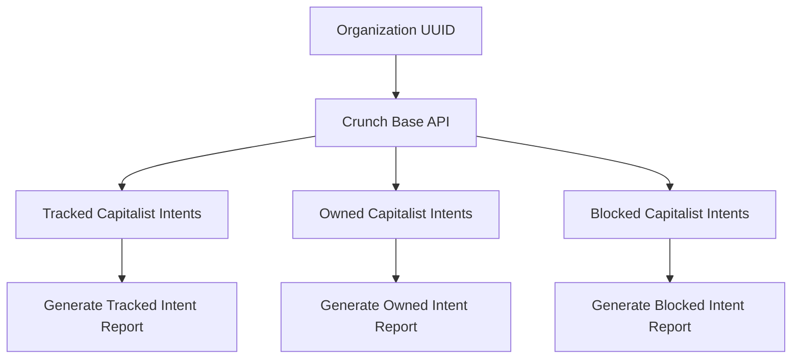

In this graph:

- `F`, `G`, and `H` represent the generation of reports for tracked, owned, and blocked capitalist intents respectively.

Now, let's update the report template to include these generated reports:

```markdown
# Report

## Organization UUID

{organization_uuid}

## Tracked Capitalist Intents

{tracked_capitalist_intents}

### Tracked Intent Report

{tracked_intent_report}

## Owned Capitalist Intents

{owned_capitalist_intents}

### Owned Intent Report

{owned_intent_report}

## Blocked Capitalist Intents

{blocked_capitalist_intents}

### Blocked Intent Report

{blocked_intent_report}
```

In this template:

- `{tracked_intent_report}`, `{owned_intent_report}`, and `{blocked_intent_report}` would be replaced with the respective generated reports.

This way, you not only fetch the capitalist intents but also generate detailed reports for each one. You can customize this process according to your needs. For instance, if there are specific details you want to include in each report, you could add those as additional sections.
